# Cloud Workflow Scheduling base on Deep Reinforcement Learning

 北京化工大学本科毕业设计《基于深度强化学习的云工作流调度》

## 有向无环图生成设计

​	工作流通常由DAG（有向无环图）来定义，其中每个计算任务$T_i$由一个顶点表示。同时，任务之间的每个数据或控制依赖性由一条加权的有向边$E_{ij}$表示。每个有向边$E_{ij}$表示$T_i$是$T_j$的父任务，$T_j$只能在其所有父任务完成后执行。一般在所有任务之前设立一个Start虚拟节点，作为所有没有父任务节点的父节点；同理，在所有任务之后设立一个Exit虚拟节点，作为所有没有子任务节点的子节点，这两个虚拟节点都没有计算资源需求。

​	确定表示一个DAG需要三个数据，分别是是节点连接信息，各节点的父节点数，各节点的子节点数。由这三个元素可以确定一个独立的DAG。

​	例如一个10个节点的DAG：

**Edges:** [(1, 5), (1, 6), (2, 4), (2, 6), (3, 6), (4, 7), (4, 9), (5, 9), (5, 7), (6, 7), ('Start', 1), ('Start', 2), ('Start', 3), ('Start', 8), ('Start', 10), (7, 'Exit'), (8, 'Exit'), (9, 'Exit'), (10, 'Exit')]

**In_degree:** [1, 1, 1, 1, 1, 3, 3, 1, 2, 1] 

**out_degree:** [2, 2, 1, 2, 2, 1, 1, 1, 1, 1] 

表示的是下面这一张图。

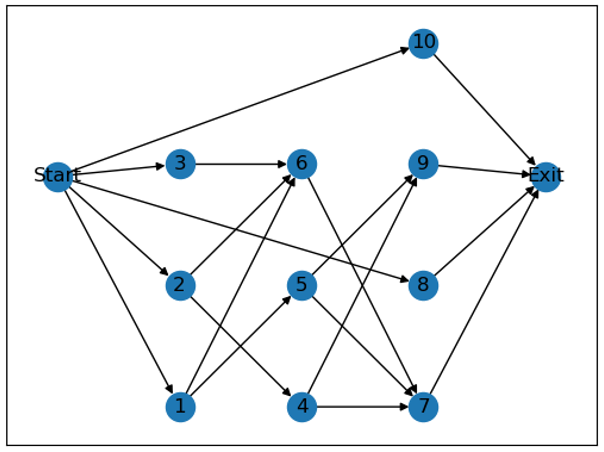

​																													图 1 一个DAG示例

参数设定为：

size = [20,30,40,50,60,70,80,90]       #DAG中任务的数量

max_out = [1,2,3,4,5]            #DAG节点的最大出度

alpha = [0.5,1.0,1.5]            #控制DAG 的形状

beta = [0.0,0.5,1.0,2.0]           #控制 DAG 的规则度

具体的实现细节如下：

1. 根据公式$length=\frac{\sqrt{size}}{alpha}$计算出生成DAG的层数，并计算平均每层的数量$\frac{size}{length}$.

2. 在以均值为$\frac{size}{length}$，标准差为$beta$的正态分布中采样每层的任务数并向上取整，这样随机采样得到的总任务数可能有偏差，随机在某几层添加或者删除任务，使DAG总任务数等于$size$。

3. 对于第一层到倒数第二层：每一个任务随机在[0, $max\_out]$，并随机连接$n$个下一层的任务。

4. 最后给所有没有入边的任务添加Start作为父节点，所有没有出边的任务添加Exit任务作为子节点，至此一个随机的DAG就生成好了。

在这里$alpha$控制的是DAG的整体形状，如果$alpha$越小，DAG越长，$alpha$越大，DAG越短。

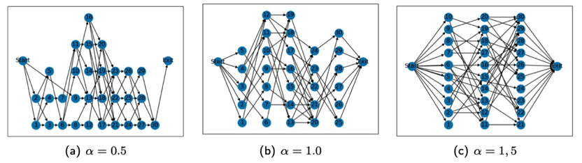

​																								图2 不同alpha下DAG的形状（n=30）

$beta$则是控制的DAG的规则度，如果$beta$越大，DAG越参差不齐。

## 添加工作流信息

对DAG中每一个任务随机分配它的持续时间和资源需求（CPU，Memory）。

为了模拟一些时间占用相对较长的任务，定义一个概率prob=80%，每个任务的持续时间有80%的几率在$[t,3t]$的范围内随机取值，20%的概率在$[10t,15t]$的范围内随机取值。

每个任务有50%的概率为CPU密集型任务，剩下的50%是Memory密集型的任务。

CPU密集型的任务CPU的资源占用量在$[0.25r,0.5r]$中随机取值，Memory的资源占用量在$[0.05,0.01]$随机取值。Memory密集型的任务资源需求量相反。

举一个根据以上规则生成的工作流信息的例子，对10个任务的 DAG 随机生成的工作流信息如下表示： (r=100,t=10)

任务占用时间 Ti: [27.174, 23.215,24.209,15.085, 20.691,29.892,20.632, 26.777, 19.402,18.362]

任务资源占用 (res_cpu,res_memory): [(31.432, 1.019), (4.7330, 25.308), (1.208, 42.542), (1.517, 47.633), (39.299, 4.826), (1.654, 46.401), (2.438, 35.593), (3.887, 42.224), (1.594, 30.074), (42.445, 3.225)]

## 马尔可夫决策过程建模

### 状态空间

1. 当前执行的时间（1维）

2. 当前资源中剩余的 CPU 资源（1维）

3. 当前资源中剩余的 Memory 资源（1维）

4. Ready_task 任务列表（长度为 10）中的任务要求时间（10维）如果不足10空位补-1

5. Ready_task 任务列表中的 CPU 要求资源（10维）      如果不足10空位补-1

6. Ready_task 任务列表中的 Memory 要求资源（10维）     如果不足10空位补-1

7. 当前未完成 DAG 部分的最大路径长度（1维）

8. 当前未完成 DAG 部分的子节点数（1维）

9. 超出 Ready_task 任务列表长度且准备好的任务的时间要求总和（1维）

10. 超出 Ready_task 任务列表长度且准备好的任务的 CPU 要求总和（1维）

11. 超出 Ready_task 任务列表长度且准备好的任务的 Memory 要求总和（1维）

共38维状态。

### 动作空间

{-1,0,1,2,3,4,5,6,7,8,9}

•选择 $a=-1$表示执行完计算资源里的一个耗时最短的任务。此时执行时间增加该任务的消耗时间，释放占用的CPU和Memory资源。

•选择$a=0\sim9$表示把当前 Ready_task 任务列表的第a个任务提交给计算资源。此时当前执行时间不变，当前CPU/Memory资源减去该任务占用的资源。

### 回报函数

•选择 $a=-1$:  $reward = -\frac{\text{执行时间}}{t}$

•选择$ a=0\sim9$: $reward = 0$

## 环境说明

实验采用OpenAI 强化学习gym平台，自定义的工作流调度环境主要包括两个函数：

### state, reward, done, infor = env.step(action)

step函数用于智能体与环境进行交互，输入动作action返回的是下一步的状态state，该步的reward，是否执行完一整个个DAG任务，和动作是否有效（infor）。 当接受到动作后智能体首先判断该动作是否有效：

a)  该动作对应的位置是没有任务（数据是-1），动作无效。

b)  计算资源不能能满足该位置上的任务的CPU/Memory资源需求，动作无效。

c)   如果当前计算资源中没有提交的任务,动作$a=-1$是无效的。

如果动作无效，重新采样动作；

如果动作有效，则更新状态：

a)  $ a=0\sim9$ ：计算资源中CPU/Memory分别减去该任务占用的资源，更新Ready_task 任务列表中该任务对应位置上的执行时间，CPU/Memory资源全部置为-1，表示该任务已经提交给计算机。

b) $a=-1$ ：表示执行当前计算机上挂起的任务，执行的时间等于已经提交的任务列表中耗时最短的任务。例如$t=0s$时计算机上挂起了三个任务，他们执行时间分别为$23s,12s,29s$,执行$a=-1$后，第二个任务耗时最短，被执行。第一维状态就变为了12s，挂起任务执行时间列表就被更新为$11s,17s$。同时，计算资源CPU/Memory加上相应的数值，之后根据DAG结构更新Ready_task 任务列表，当前未完成 DAG 部分的最大路径长度，当前未完成 DAG 部分的子节点数等状态。

### state = env.reset()

reset函数表示初始化环境，包括随机生成一个DAG并且生成工作流信息。返回的是初始38维状态。

## 强化学习算法与具体实现

### Actor-Crtitc

采用Actor-Critic框架，伪代码如下。引入两个结构相同的网络分别作为策略网络和状态价值网络，策略网络输出的是动作的概率分布，状态价值网络输出的是当前状态的估计价值。

采用REINFORCE算法更新Actor网络，在计算target($\delta$) 时用当步的估计收益减去Critic网络的价值基线，以减小方差。

由于动作采样可能采样到无效动作（例如Ready_task 任务列表只有3个任务，动作采样到了9），当动作无效时，记录当前actor网络输出的概率分布，将采样到的动作概率置0，按照其他动作的概率重新生成分布，再从新的分布中采样动作，直到动作有效。但是在最后更新actor网络时，$\nabla_{\boldsymbol{\theta}} \log \pi\left(A_{t} \mid S_{t}, \boldsymbol{\theta}\right)$的计算还是用最开始记录的概率。

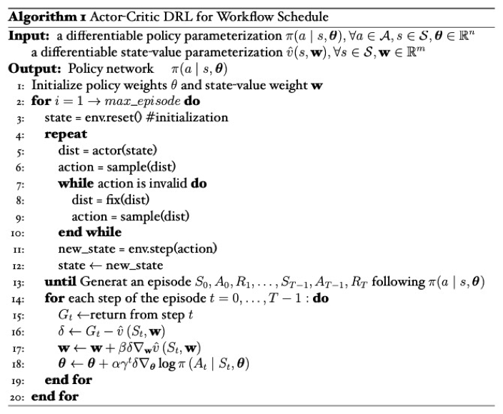

### Proximal Policy Optimization

暂时未更新伪代码，代码来源https://github.com/nikhilbarhate99/PPO-PyTorch。

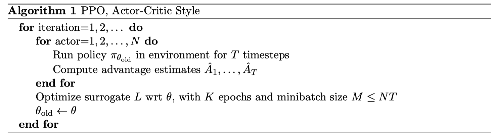

## 实验

### 对比方法

1. Shortest Job First（SJF）：首先选择耗时最短的任务执行。SJF首先按可执行任务的时间从小到大排序，将任务放入计算资源中直到放不下后，再执行动作$a=-1$
2. Random：在{-1,0,1,2,3,4,5,6,7,8,9}中随机执行动作，若遇到无效动作重新随机。
3. Tetris: *Multi-Resource Packing for Cluster Schedulers* 中为最小makespan设计的策略。

​		

#### Tetris

Tetris, a cluster scheduler that packs tasks to machines based on their requirements along multiple resources.

objectives：

$\bullet$Packing Efficiency for Makespan

$\bullet$Average Completion Time

$\bullet$Fairness


现在Ready task列表中有2个任务，CPU和memory需求资源分别为: $[t_1:(31.432, 1.019), t_{2}:(4.733, 25.308)，t_{3}:(15.000, 1.019)]$

假设当前资源中CPU和memory剩余的资源为(30,60)。

计算任务的Alignment Score：

$$AS_2 = (4.733,25.308)\cdot (30,60) = 4.733\times 30+25.308\times 60 = 1660.47$$

$$AS_3 = (15.000,1.019)\cdot (30,60) = 15.000\times 30+1.019\times 60 = 511.14$$

因为$AS_{2}>AS_{3}$，因此先选择$t_{2}$执行。

在每次选择动作的时候，计算ready task中的每一个任务的Alignment Score，选择最大AC的任务放在计算资源上，然后重复计算，放置，直到计算资源上不能再容纳更多的任务，这时候动作$a=-1$。


在只考虑makespan时不一定能减少任务的平均完成时间。例如：

Machines have 2 cores and 4GB of memory.

$t_{1} $ 有6个任务，每个任务需要 [2 cores, 3 GB], $t_{2}$有两个任务，每个任务需要 [1 cores, 2 GB]

如果按照alignment score的方法的计算，先执行$t_1$，再执行$t_{2}$,这样的话很明显平均任务完成时间要比先先执行$t_1$再执行$t_{2}$的长。、

一种常见的减少任务平均完成时间的算法就是Shortest Job First(SJF)。

为了同时优化Makespan和average completion time两个目标，定义分数：$(a+\varepsilon \cdot p)$

式中，$\varepsilon=(\bar{a} / \bar{p})$，$a$ 表示 alignment score，$p$表示任务持续时间。


以上三种方法均在同样的gym环境中交互，这意味着SJF方法仅仅知道Ready_task 任务列表10个长度的信息。

### PPO单图训练


### 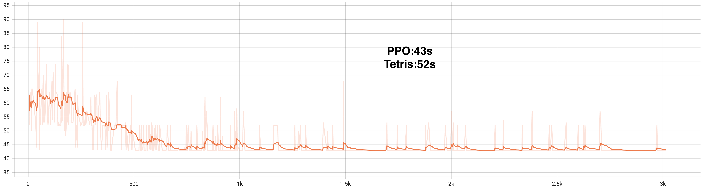

​                                                                                                          n = 10

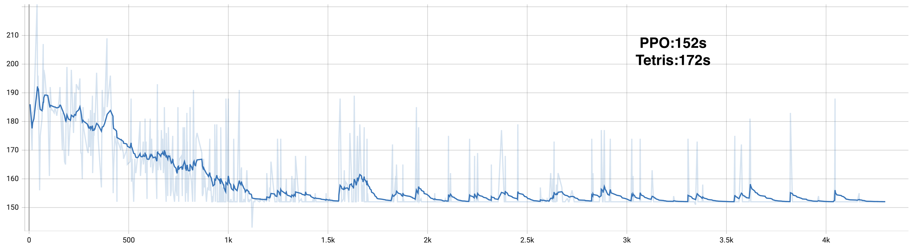

​																										n = 30


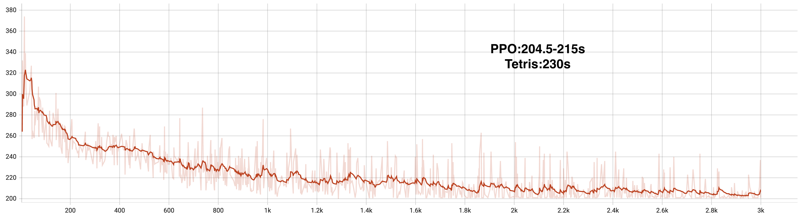

​																										n = 50

### AC参数信息

```python
1.	class Actor(nn.Module): #策略网络  
2.	    def __init__(self, state_size, action_size):  
3.	        super(Actor, self).__init__()  
4.	        self.state_size = state_size  
5.	        self.action_size = action_size  
6.	        self.linear1 = nn.Linear(self.state_size, 40)  
7.	        self.dropout = nn.Dropout(p=0.6)  
8.	        self.linear2 = nn.Linear(40, 40)  
9.	        self.linear3 = nn.Linear(40, self.action_size)  
10.	  
11.	    def forward(self, state):  
12.	        output = F.sigmoid(self.linear1(state))  
13.	        output = self.dropout(output)  
14.	        output = self.linear3(output)  
15.	        distribution = Categorical(F.softmax(output, dim=-1))  
16.	        return distribution #输出动作概率分布  

1.	Class Critic(nn.Module) #状态值函数网络 
2.	    def __init__(self, state_size, action_size):  
3.	        super(Critic, self).__init__()  
4.	        self.state_size = state_size  
5.	        self.action_size = action_size  
6.	        self.linear1 = nn.Linear(self.state_size, 40)  
7.	        self.dropout = nn.Dropout(p=0.6)  
8.	        self.linear2 = nn.Linear(40, 40)  
9.	        self.linear3 = nn.Linear(40, 1)  
10.	  
11.	    def forward(self, state):  
12.	        output = F.relu(self.linear1(state))  
13.	        output = self.dropout(output)  
14.	        value = self.linear3(output)  
15.	        return value #输出状态值函数  

```

网络参数在训练时都有改动，基本上是选择这样三层的网络，神经元从40-400都有试过，激活函数用relu的话容易导致输出概率极小趋近于零，尝试使用sigmoid后就没有出现过这个问题。

可变动的一些参数：

| **参数设置**            |                                    |
| ----------------------- | ---------------------------------- |
| Episode                 | 1000至10000                        |
| learning rate           | 0.0001                             |
| size                    | [20,30,40,50,60,70,80,90]or random |
| max_out                 | [1,2,3,4,5] or random              |
| alpha                   | [0.5,1.0,1.5] or random            |
| beta                    | [0.0,0.5,1.0,2.0] or random        |
| Reward = -time_shift/10 |                                    |
| prob = 0.8              |                                    |

在各种实验条件下训练网络，虽然AC网络都在loss上表现收敛，但训练过程中reward和makespan表现太过于随机，整体趋势也时好时坏。于是尝试将状态空间**降维**，删除了第7，8，9，10，11维状态，也就是从原来的38维状态减少至前33维状态，这样的话给智能体感知的DAG整体结构信息就变少了，但这样做有更大几率训练出好一点的模型，下面这个网络在参数learning rate = 0.0001 size = 20 max_out = 3 alpha = 2 beta = 1 prob = 1 的情况下训练1000次偶然得出一个比较好的智能体：

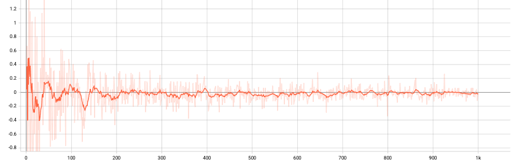

​																														图3 actor loss

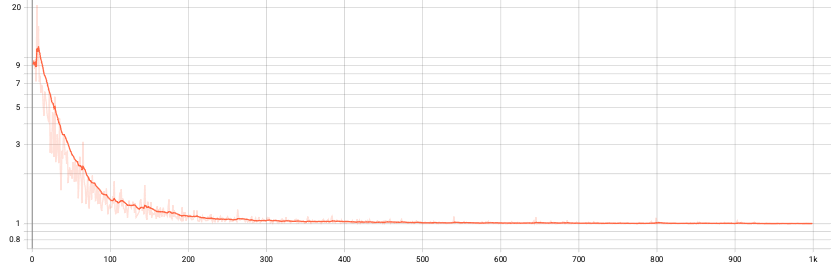

​																														图 4 critic loss

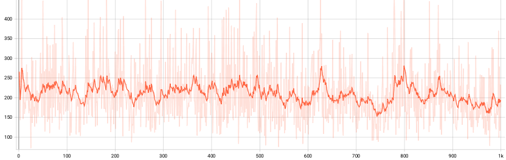

​																														图 5 makespan

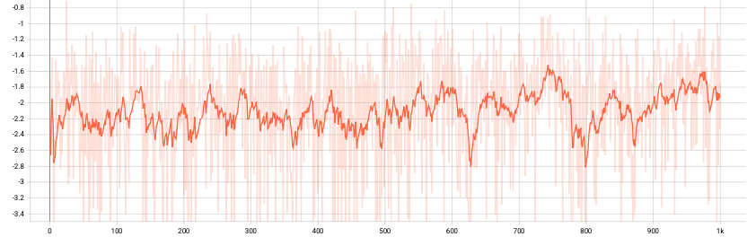

​																														图 6 reward

因为收益设置为Reward = -time_shift/100，所以makespan和reward训练的趋势差不多是相反的，但把Smoothing拉到最大后并没有明显的下降趋势。

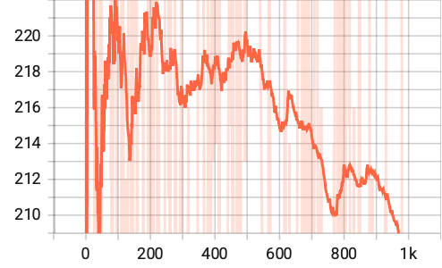

​																										图 7 makespan (smoothing=0.999)

随后将该训练好的网络与SJF和random方法对比，使用相同的env环境，每个方法求解100个DAG任务（因为gym环境的限制，每个方法各按照同样的参数生成100个DAG；如果要对比每种方法求解同样的一个DAG任务，会比较麻烦。），观察makespan数据。

1. max_out = 3 alpha = 2 beta = 1 prob = 1，在n=10,30,50中的表现：

   | 不同方法在不同size下的makespan平均值(单位s) |        |        |        |
   | ------------------------------------------- | ------ | ------ | ------ |
   |                                             | A-C    | SJF    | Random |
   | N=10                                        | 72.88  | 76.53  | 109.53 |
   | N=20                                        | 186.02 | 207.50 | 277.70 |
   | N=30                                        | 288.85 | 331.94 | 446.32 |

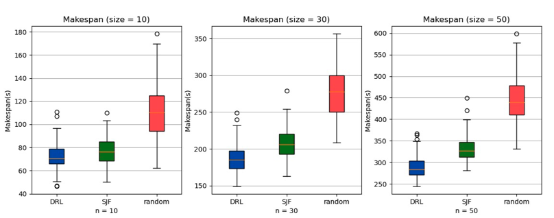

​																												图8 各方法的实验数据对比

从图中可以看出AC网络训练出来的模型要优于SJF方法，智能体学习到的策略要优于SJF方法 5%-15%，优于Random方法50%-54% 尤其是当DAG规模变大之后，DRL的优势更明显。在之后的实验中，不断修改max_out, alpha, beta, prob等参数，情况大致相同，DRL都要优于其余两种方法。

对于下一图每一小组实验数据，都是随机生成100张不同的DAG图进行处理。


