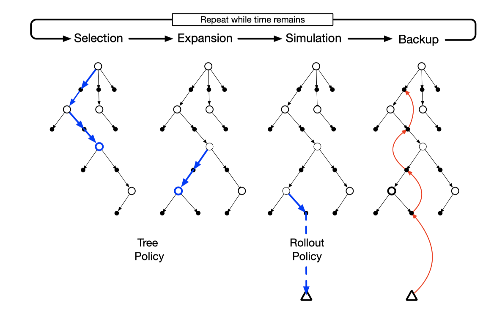
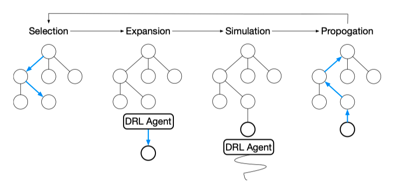
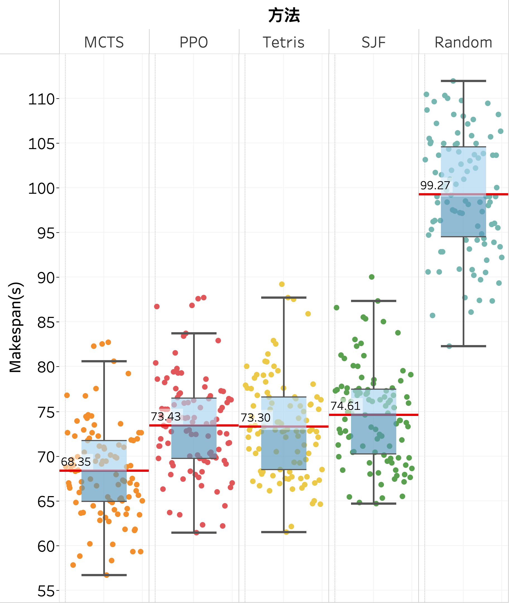

# Cloud Workflow Scheduling base on Deep Reinforcement Learning

 北京化工大学本科毕业设计《基于深度强化学习的云工作流调度》

 关键词：有向无环图，工作流，深度强化学习，图神经网络； 蒙特卡洛树搜索

## Installation

It requires the following packages:

- Python 3.9.7
- torch 1.10
- gym  0.21.0
- networkx 2.6.3

## Instructions

1. 将 Env/___.py 文件注册在gym的环境中；
2. 运行 DAGs_generator.py 生成 train dataset， test dataset.
3. 修改环境代码适应生成数据集的路径；
4. 运行 PPO/DRLagent.py 训练网络；
5. 运行 PPO/DRLtest.py 测试推理。
5. 运行baseline_tableau.py 得出baseline算法效果
5. 运行MonteCarloTreeSearch.py 得出MCTS算法效果

## 目前进度

2022.03.11

- 目前状态空间，动作空间下设计的Actor- Critic，PPO方法难以超越baseline [Tetris](https://dl.acm.org/doi/abs/10.1145/2740070.2626334?casa_token=EYl_WpNS79MAAAAA:iNwogrNmlUceBfJ-P0vySitXQzV01kmwGmkRj4qTHPeqBiyd04Zqt6giZpwvOR3TgR1Nv46_8jJYdt0)的效果。
- 尝试经典[GCN](https://arxiv.org/abs/1609.02907)编码DAG，效果不佳。
- 尝试[Decima](https://dl.acm.org/doi/abs/10.1145/3341302.3342080)中的编码结构。

2020.03.23

- 结合[Decima](https://dl.acm.org/doi/abs/10.1145/3341302.3342080)中的[GCN](https://arxiv.org/abs/1609.02907)对DAG进行编码，改变编码数量，效果不佳
- 完成深度强化学习加速蒙特卡洛树搜索算法（魔改[spear](https://ieeexplore.ieee.org/abstract/document/8885307/)），目前在DAG_size=10大小上效果最佳。
- 编写了单个DAG任务资源用量检测脚本。

## 有向无环图生成设计

​	工作流通常由DAG（有向无环图）来定义，其中每个计算任务$T_i$由一个顶点表示。同时，任务之间的每个数据或控制依赖性由一条加权的有向边$E_{ij}$表示。每个有向边$E_{ij}$表示$T_i$是$T_j$的父任务，$T_j$只能在其所有父任务完成后执行。一般在所有任务之前设立一个Start虚拟节点，作为所有没有父任务节点的父节点；同理，在所有任务之后设立一个Exit虚拟节点，作为所有没有子任务节点的子节点，这两个虚拟节点都没有计算资源需求。

​	确定表示一个DAG需要三个数据，分别是是节点连接信息，各节点的父节点数，各节点的子节点数。由这三个元素可以确定一个独立的DAG。

​	例如一个10个节点的DAG：

**Edges:** [(1, 5), (1, 6), (2, 4), (2, 6), (3, 6), (4, 7), (4, 9), (5, 9), (5, 7), (6, 7), ('Start', 1), ('Start', 2), ('Start', 3), ('Start', 8), ('Start', 10), (7, 'Exit'), (8, 'Exit'), (9, 'Exit'), (10, 'Exit')]

**In_degree:** [1, 1, 1, 1, 1, 3, 3, 1, 2, 1] 

**out_degree:** [2, 2, 1, 2, 2, 1, 1, 1, 1, 1] 

表示的是下面这一张图。

​																													图 1 一个DAG示例

参数设定为：

size = [20,30,40,50,60,70,80,90]       #DAG中任务的数量

max_out = [1,2,3,4,5]            #DAG节点的最大出度

alpha = [0.5,1.0,1.5]            #控制DAG 的形状

beta = [0.0,0.5,1.0,2.0]           #控制 DAG 的规则度

具体的实现细节如下：

1. 根据公式$length=\frac{\sqrt{size}}{alpha}$计算出生成DAG的层数，并计算平均每层的数量$\frac{size}{length}$.

2. 在以均值为$\frac{size}{length}$，标准差为$beta$的正态分布中采样每层的任务数并向上取整，这样随机采样得到的总任务数可能有偏差，随机在某几层添加或者删除任务，使DAG总任务数等于$size$。

3. 对于第一层到倒数第二层：每一个任务随机在[0, $max\_out]$，并随机连接$n$个下一层的任务。

4. 最后给所有没有入边的任务添加Start作为父节点，所有没有出边的任务添加Exit任务作为子节点，至此一个随机的DAG就生成好了。

在这里$alpha$控制的是DAG的整体形状，如果$alpha$越小，DAG越长，$alpha$越大，DAG越短。

​																								图2 不同alpha下DAG的形状（n=30）

$beta$则是控制的DAG的规则度，如果$beta$越大，DAG越参差不齐。

## 添加工作流信息

对DAG中每一个任务随机分配它的持续时间和资源需求（CPU，Memory）。

为了模拟一些时间占用相对较长的任务，定义一个概率prob=80%，每个任务的持续时间有80%的几率在$[t,3t]$的范围内随机取值，20%的概率在$[10t,15t]$的范围内随机取值。

每个任务有50%的概率为CPU密集型任务，剩下的50%是Memory密集型的任务。

CPU密集型的任务CPU的资源占用量在$[0.25r,0.5r]$中随机取值，Memory的资源占用量在$[0.05,0.01]$随机取值。Memory密集型的任务资源需求量相反。

举一个根据以上规则生成的工作流信息的例子，对10个任务的 DAG 随机生成的工作流信息如下表示： (r=100,t=10)

任务占用时间 Ti: [27.174, 23.215,24.209,15.085, 20.691,29.892,20.632, 26.777, 19.402,18.362]

任务资源占用 (res_cpu,res_memory): [(31.432, 1.019), (4.7330, 25.308), (1.208, 42.542), (1.517, 47.633), (39.299, 4.826), (1.654, 46.401), (2.438, 35.593), (3.887, 42.224), (1.594, 30.074), (42.445, 3.225)]

## 马尔可夫决策过程建模

### 状态空间

1. 当前执行的时间（1维）

2. 当前资源中剩余的 CPU 资源（1维）

3. 当前资源中剩余的 Memory 资源（1维）

4. Ready_task 任务列表（长度为 10）中的任务要求时间（30维）如果不足30空位补-1

5. Ready_task 任务列表中的 CPU 要求资源（30维）      如果不足30空位补-1

6. Ready_task 任务列表中的 Memory 要求资源（30维）     如果不足30空位补-1

7. 当前未完成 DAG 部分的最大路径长度（1维）

8. 当前未完成 DAG 部分的子节点数（1维）

9. 超出 Ready_task 任务列表长度且准备好的任务的时间要求总和（1维）

10. 超出 Ready_task 任务列表长度且准备好的任务的 CPU 要求总和（1维）

11. 超出 Ready_task 任务列表长度且准备好的任务的 Memory 要求总和（1维）

共98维状态。

### 动作空间

{-1,0,1,2,3,4,5,6,7,8,9,...,29}

•选择 $a=-1$表示执行完计算资源里的一个耗时最短的任务。此时执行时间增加该任务的消耗时间，释放占用的CPU和Memory资源。

•选择$a=0\sim29$表示把当前 Ready_task 任务列表的第a个任务提交给计算资源。此时当前执行时间不变，当前CPU/Memory资源减去该任务占用的资源。

### 回报函数

•选择 $a=-1$:  $reward = -\frac{\text{执行时间}}{t}$

•选择$ a=0\sim9$: $reward = 0$

## 环境说明

实验采用OpenAI 强化学习gym平台，自定义的工作流调度环境主要包括两个函数：

### state, reward, done, infor = env.step(action)

step函数用于智能体与环境进行交互，输入动作action返回的是下一步的状态state，该步的reward，是否执行完一整个个DAG任务，和动作是否有效（infor）。 当接受到动作后智能体首先判断该动作是否有效：

a)  该动作对应的位置是没有任务（数据是-1），动作无效。

b)  计算资源不能能满足该位置上的任务的CPU/Memory资源需求，动作无效。

c)   如果当前计算资源中没有提交的任务,动作$a=-1$是无效的。

如果动作无效，重新采样动作；

如果动作有效，则更新状态：

a)  $ a=0\sim29$ ：计算资源中CPU/Memory分别减去该任务占用的资源，更新Ready_task 任务列表中该任务对应位置上的执行时间，CPU/Memory资源全部置为-1，表示该任务已经提交给计算机。

b) $a=-1$ ：表示执行当前计算机上挂起的任务，执行的时间等于已经提交的任务列表中耗时最短的任务。例如$t=0s$时计算机上挂起了三个任务，他们执行时间分别为$23s,12s,29s$,执行$a=-1$后，第二个任务耗时最短，被执行。第一维状态就变为了12s，挂起任务执行时间列表就被更新为$11s,17s$。同时，计算资源CPU/Memory加上相应的数值，之后根据DAG结构更新Ready_task 任务列表，当前未完成 DAG 部分的最大路径长度，当前未完成 DAG 部分的子节点数等状态。

### state = env.reset()

reset函数表示初始化环境，包括随机生成一个DAG并且生成工作流信息。返回的是初始38维状态。

## 强化学习算法与具体实现

### Actor-Crtitc

采用Actor-Critic框架，伪代码如下。引入两个结构相同的网络分别作为策略网络和状态价值网络，策略网络输出的是动作的概率分布，状态价值网络输出的是当前状态的估计价值。

采用REINFORCE算法更新Actor网络，在计算target($\delta$) 时用当步的估计收益减去Critic网络的价值基线，以减小方差。

由于动作采样可能采样到无效动作（例如Ready_task 任务列表只有3个任务，动作采样到了9），当动作无效时，记录当前actor网络输出的概率分布，将采样到的动作概率置0，按照其他动作的概率重新生成分布，再从新的分布中采样动作，直到动作有效。但是在最后更新actor网络时，$\nabla_{\boldsymbol{\theta}} \log \pi\left(A_{t} \mid S_{t}, \boldsymbol{\theta}\right)$的计算还是用最开始记录的概率。

### Proximal Policy Optimization

暂时未更新伪代码，代码来源https://github.com/nikhilbarhate99/PPO-PyTorch。

### 蒙特卡洛树搜索

蒙特卡洛树搜索是一种高效的决策规划算法，主要应用于以 (状态，行动) 定义和用模拟进行 预测输出结果的领域（例如：围棋）。它是一种基于树数据结构的、在搜索空间巨大的时候仍 然比较有效的搜索算法。

蒙特卡洛树搜索算法主要分为 4 步：选择，扩展，模拟，回溯。 我们将节点分成三类：

- 未访问：还没有评估过当前局面

- 未完全展开：被评估过至少一次，但是子节点（下一步的局面）没有被全部访问过，可以进一步扩展

- 完全展开：子节点被全部访问过

  我们找到目前认为「最有可能会走到的」一个未被评估的局面，并且选择它。

  (1) 选择（seletion)：这一步会从根节点开始，根据树策略选一个“最值得搜索的叶子节点”，一般使用 Upper Confidence Bound Applied to Trees(UCT) 标准选择分数最高的节点，直到来到一个“存在未 扩展的子节点”的节点。

  UCT: $\quad$ score $=\frac{w_{i}}{n_{i}}+c \sqrt{\frac{\ln N_{i}}{n_{i}}}$

  式中 $w_i$ 是$ i$ 节点胜利次数，$n_i$ 是 $i$ 节点的模拟次数，$N_I$ 是所有模拟次数，$c$ 是探索常数，$c$ 约小越偏向于开发，$c$ 越大越偏向于试探。这个树策略函数相当于在开发和试探做权衡。

  (2) 扩展（expansion）：在选择阶段结束时候，我们查找到了一个最迫切被拓展的节点 $N$，以 及一个尚未拓展的动作$ A$。动作 $A $选取在这里是随机的。

  (3) 模拟 (simulation)：我们从 $N_n$开始，让游戏快速地随机进行，直到得到一个游戏结局， 得到的是一次蒙特卡洛实验，这个结局将作为 $N_n$的初始评分。一般使用胜利/失败来作为评分，只有 $1$ 或者$0$。 模拟一般适合很快可能不是很精确的策略。比如一般的蒙特卡洛树使用随机的策略，精度不一定高，但速度快，本文使用了 DRL 辅助搜索策略，结果又快又准。

  (4) 回溯 (backpropagation)：在 $N_n$的模拟结束之后，从叶节点到根节点由下到上的路径上的所有节 点都会根据本次模拟的结果来更新累计评分。 每一次迭代都会拓展搜索树，随着迭代次数的增加，搜索树的规模也不断增加。当到了一定的迭代 次数或者时间之后结束，选择根节点下最好的子节点作为本次决策的结果。

  ### 蒙特卡洛树结合深度强化学习智能体搜索

  论文：[Multi-resource packing for cluster schedulers]((https://dl.acm.org/doi/abs/10.1145/2740070.2626334?casa_token=EYl_WpNS79MAAAAA:iNwogrNmlUceBfJ-P0vySitXQzV01kmwGmkRj4qTHPeqBiyd04Zqt6giZpwvOR3TgR1Nv46_8jJYdt0)-resource ) 

  **Spear** 使用 DRL 加速蒙特卡洛树搜索，解决了目标是 makespan 最短的多资源需求的 DAG 问 题。Spear 根据当前计算资源和任务的状态用 MCTS 搜索最佳动作，在树扩张和模拟的过程中 使用 DRL 来将搜索区域缩小到更具有价值的动作空间。结果表明，Spear 在花费相同的时间 内，完成时间上要短于之前最好的方法 Graphene。

  **Spear**: 核心思想：用 DRL 模型替代 MCTS 中扩展和模拟中随机选择动作的策略。有以下优点：

  (1) 训练过的 DRL 模型，可以将动作搜索范围缩小到那些更快完成调度任务的动作上；

  (2) 在 Simulation 中可以精准的估计每一个状态的 makespan。

  

  改进的蒙特卡洛树搜索:

  (1) 选择：将UCT公式中的前一项改为最大的 reward，也就是：

  score $=\max _{I}+c \sqrt{\frac{\ln N_{i}}{n_{i}}}$

  (2) 扩展: 当前状态下有许多动作都是没必要探索的，传统的 MCTS 使用随机策略选择动作， 很显然是不高效的。不过，训练好的 DRL 模型可以高效的选择未被探索过的动作，根据 策略网络输出动作的概率，makespan 越小的动作具有越高的概率。

  (3) 模拟：同样使用训练好的 DRL 模型来选择动作，这提供了更有意义的 makespan 估计。

  (4)回溯：更新从叶节点到根节点路径上所有节点的值：max{current_value, new_value } ， 并且记录该节点上 value 的平均值。 

- The budget（控制树搜索次数）：$\max \left(\frac{b_{i n i t i a l}}{d_{i}}, b_{\min }\right)$

  $d_i$ 是目前树的深度，$b_{initial}$ 是初始迭代预算次数，$b_min$ 是最小迭代预算次数。

## 实验

### 对比方法

1. Shortest Job First（SJF）：首先选择耗时最短的任务执行。SJF首先按可执行任务的时间从小到大排序，将任务放入计算资源中直到放不下后，再执行动作$a=-1$
2. Random：在{-1,0,1,2,3,4,5,6,7,8,9}中随机执行动作，若遇到无效动作重新随机。
3. Tetris: *Multi-Resource Packing for Cluster Schedulers* 中为最小makespan设计的策略。

​		

#### Tetris

Tetris, a cluster scheduler that packs tasks to machines based on their requirements along multiple resources.

objectives：

$\bullet$Packing Efficiency for Makespan

$\bullet$Average Completion Time

$\bullet$Fairness

现在Ready task列表中有2个任务，CPU和memory需求资源分别为: $[t_1:(31.432, 1.019), t_{2}:(4.733, 25.308)，t_{3}:(15.000, 1.019)]$

假设当前资源中CPU和memory剩余的资源为(30,60)。

计算任务的Alignment Score：

$$AS_2 = (4.733,25.308)\cdot (30,60) = 4.733\times 30+25.308\times 60 = 1660.47$$

$$AS_3 = (15.000,1.019)\cdot (30,60) = 15.000\times 30+1.019\times 60 = 511.14$$

因为$AS_{2}>AS_{3}$，因此先选择$t_{2}$执行。

在每次选择动作的时候，计算ready task中的每一个任务的Alignment Score，选择最大AC的任务放在计算资源上，然后重复计算，放置，直到计算资源上不能再容纳更多的任务，这时候动作$a=-1$。

在只考虑makespan时不一定能减少任务的平均完成时间。例如：

Machines have 2 cores and 4GB of memory.

$t_{1} $ 有6个任务，每个任务需要 [2 cores, 3 GB], $t_{2}$有两个任务，每个任务需要 [1 cores, 2 GB]

如果按照alignment score的方法的计算，先执行$t_1$，再执行$t_{2}$,这样的话很明显平均任务完成时间要比先先执行$t_1$再执行$t_{2}$的长。、

一种常见的减少任务平均完成时间的算法就是Shortest Job First(SJF)。

为了同时优化Makespan和average completion time两个目标，定义分数：$(a+\varepsilon \cdot p)$

式中，$\varepsilon=(\bar{a} / \bar{p})$，$a$ 表示 alignment score，$p$表示任务持续时间。

以上三种方法均在同样的gym环境中交互，这意味着SJF方法知道Ready_task 任务列表30个长度的信息。

### 最终实验结果

​       N=10 

